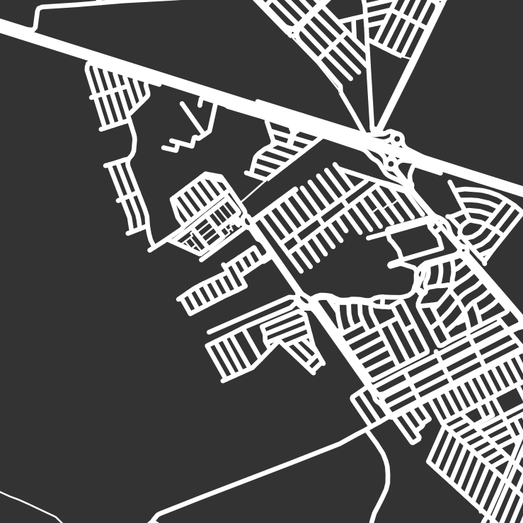
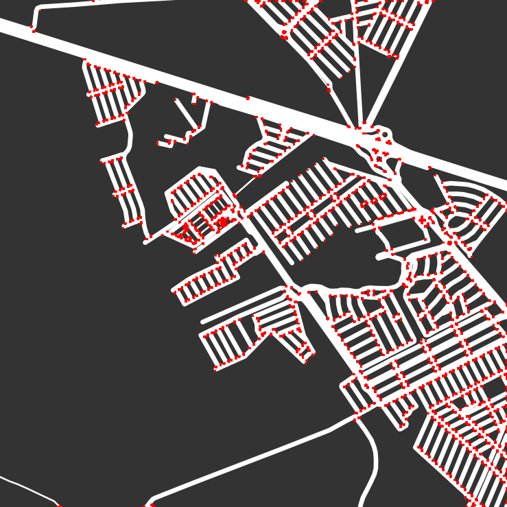

# A Harris Corner Detection approach for Segment the Number of Corner in Street Map

## Stree map

<p align="center"> </p> 
<h6 align="center">The figure show two images of street map. The <i>Left</i> image describe dataset input, and <i>right</i> is harris corner detection result.</h6>


## Getting Started

### Prerequisites
What things you need to undertand this repository

```
 Good knowledgment in Computer Vision, and know how to use .sh file ".sh" (command-line interpreter).
```

### Installing

The first step is install the argparse library:

```
 pip install argparse
```

And finally install the OpenCv library:

```
    pip install opencv-python
```


## Usage

To run this repository, please open the terminal and run the following command:

```
 sh run.sh
```
#

<p align="center"><b>Sincerely:</b> <a href="https://github.com/neemiasbsilva">Neemias B. da Silva</a></p>

#